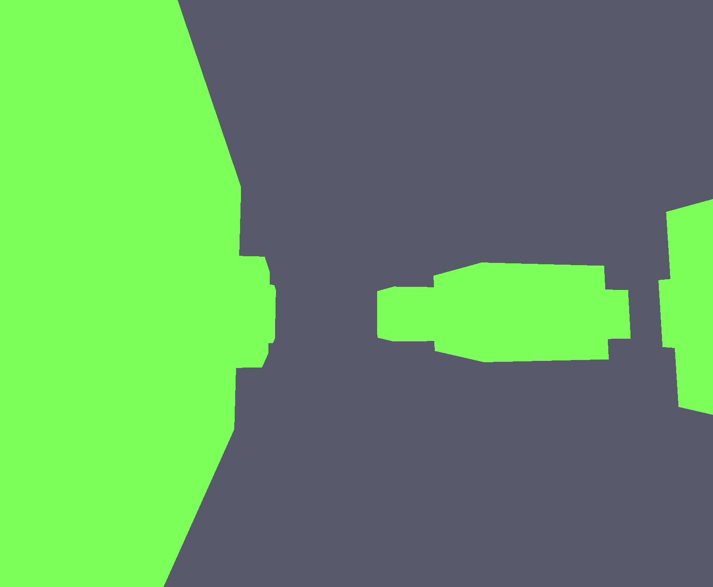
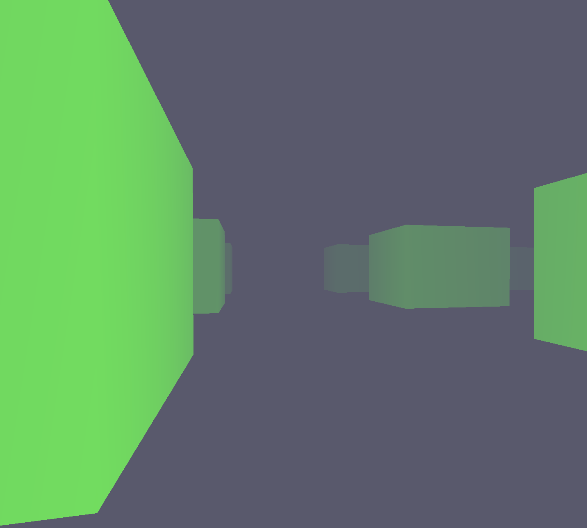

Fog is one of the cheapest ways to add depth and atmosphere to a scene. In this post we'll break down exponential fog: where the formula comes from, how to compute it in a shader, and how to blend the result with the object color. The shaders are written in [Slang](https://shader-slang.org/), but the logic translates directly to any shading language — GLSL, HLSL, MSL.

Here's the scene **before** fog:



## Full shader code

### Vertex shader

```hlsl
struct Input
{
    float3 pos : POSITION;
    float2 uv : TEXCOORD;
}

struct Output
{
    float4 sv_position : SV_Position;
    float2 uv : TEXCOORD;
    float depth : TEXCOORD1;
}

struct Transform
{
    column_major float4x4 model;
    column_major float4x4 view;
    column_major float4x4 proj;
}

ParameterBlock<Transform> uTransform;

[shader("vertex")]
Output main(Input input)
{
    float4 worldPos = mul(uTransform.model, float4(input.pos, 1.0f));
    float4 viewPos  = mul(uTransform.view, worldPos);
    Output output;
    output.sv_position = mul(uTransform.proj, viewPos);
    output.uv          = input.uv;
    output.depth       = length(viewPos.xyz);
    return output;
}
```

### Fragment shader

```hlsl
struct Input
{
    float4 sv_position : SV_Position;
    float2 uv : TEXCOORD;
    float depth : TEXCOORD1;
}

[shader("fragment")]
float4 main(Input input) : SV_Target
{
    float3 objectColor = float3(0.2f, 1.0f, 0.1f);
    float3 fogColor    = float3(0.1f, 0.1f, 0.15f);
    float  density     = 0.5f;

    float fogFactor = exp(-density * input.depth);
    fogFactor = clamp(fogFactor, 0.0f, 1.0f);

    float3 finalColor = lerp(fogColor, objectColor, fogFactor);

    return float4(finalColor, 1.0f);
}
```

## Breaking it down

### Vertex shader input

```hlsl
struct Input
{
    float3 pos : POSITION;
    float2 uv  : TEXCOORD;
}
```

Standard vertex attributes: position in local space and UV coordinates. The UVs aren't used for anything meaningful here — they're present because vertex attributes are built from shader reflection and the cube vertex buffer already includes texture coordinates.

### Vertex shader output

```hlsl
struct Output
{
    float4 sv_position : SV_Position;
    float2 uv          : TEXCOORD;
    float  depth       : TEXCOORD1;
}
```

Everything standard, plus one key field — `depth`. It stores the distance from the camera to this point in space and gets passed to the fragment shader as an interpolated value.

### Uniform buffer

```hlsl
struct Transform
{
    column_major float4x4 model;
    column_major float4x4 view;
    column_major float4x4 proj;
}

ParameterBlock<Transform> uTransform;
```

A plain MVP uniform buffer: model matrix, view matrix, projection matrix.

### Vertex shader — computing depth

```hlsl
float4 worldPos = mul(uTransform.model, float4(input.pos, 1.0f));
float4 viewPos  = mul(uTransform.view, worldPos);

output.sv_position = mul(uTransform.proj, viewPos);
output.uv          = input.uv;
output.depth       = length(viewPos.xyz);
```

We transform the vertex position to world space, then to view space. The clip-space position comes from multiplying by the projection matrix — the usual path.

`depth` is computed as `length(viewPos.xyz)` — the Euclidean distance from the camera to the vertex in view space. The farther away the vertex, the larger `depth` and the stronger the fog.

> View space is the right place to measure this. In clip/NDC space the position is already distorted by the projection, so distances are no longer meaningful.

### Fragment shader input

```hlsl
struct Input
{
    float4 sv_position : SV_Position;
    float2 uv          : TEXCOORD;
    float  depth       : TEXCOORD1;
}
```

The GPU interpolates `depth` across the triangle, so the fragment shader receives a smoothly varying distance for every pixel — not just at the vertices.

### Fragment shader — the fog formula

```hlsl
float3 objectColor = float3(0.2f, 1.0f, 0.1f);
float3 fogColor    = float3(0.1f, 0.1f, 0.15f);
float  density     = 0.5f;
```

`objectColor` is the surface color, `fogColor` is the fog color (dark blueish), and `density` controls how thick the fog is. The higher the density, the faster objects disappear into it.

```hlsl
float fogFactor = exp(-density * input.depth);
fogFactor = clamp(fogFactor, 0.0f, 1.0f);
```

This is the exponential fog formula:

```
fogFactor = e^(-density * depth)
```

At `depth = 0` (object right in front of the camera): `e^0 = 1` — fog has no effect.  
At large `depth`: `e^(-large) → 0` — the object is completely hidden by fog.

The `clamp` keeps the value in `[0, 1]`. It's technically redundant since `exp` with positive arguments never leaves that range, but it's a harmless safety net.

```hlsl
float3 finalColor = lerp(fogColor, objectColor, fogFactor);
```

Linear interpolation between the fog color and the object color, driven by `fogFactor`. When `fogFactor = 1` you get the pure object color. When `fogFactor = 0` you get the pure fog color.

```hlsl
return float4(finalColor, 1.0f);
```

Return the final color with full opacity.

## Result



Distant objects fade smoothly into the dark fog. The effect is cheap: one `exp` and one `lerp` per fragment, no extra geometry or textures required.

## Tweaking the parameters

| Parameter | Effect |
|---|---|
| Higher `density` | Thicker fog, objects disappear closer to the camera |
| Lower `density` | Lighter fog, objects visible from farther away |
| Lighter `fogColor` | Looks like haze or overcast sky |
| Darker `fogColor` | Dark atmosphere, like night fog |
